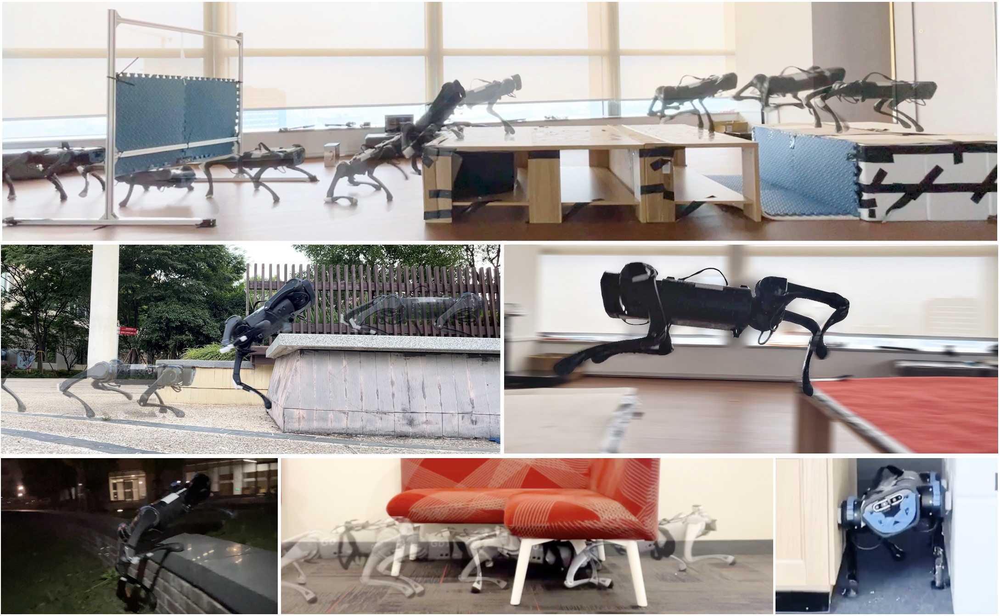

# Robot Parkour Learning #
Project website: [https://robot-parkour.github.io/](https://robot-parkour.github.io/) <br>
Authors: 
[Ziwen Zhuang*](https://ziwenzhuang.github.io/),
[Zipeng Fu*](https://zipengfu.github.io/),
[Jianren Wang](https://www.jianrenw.com),
[Christopher Atkeson](http://www.cs.cmu.edu/~cga/),
[Sören Schwertfeger](https://robotics.shanghaitech.edu.cn/people/soeren),
[Chelsea Finn](https://ai.stanford.edu/~cbfinn/),
[Hang Zhao](https://hangzhaomit.github.io/)<br>
Conference on Robot Learning (CoRL) 2023, **Oral**, **Best Systems Paper Award Finalist (top 3)** <br>

<p align="center">
  
</p>

## Repository Structure ##
* `legged_gym`: contains the isaacgym environment and config files.
    - `legged_gym/legged_gym/envs/a1/`: contains all the training config files.
    - `legged_gym/legged_gym/envs/base/`: contains all the environment implementation.
    - `legged_gym/legged_gym/utils/terrain/`: contains the terrain generation code.
* `rsl_rl`: contains the network module and algorithm implementation. You can copy this folder directly to your robot.
    - `rsl_rl/rsl_rl/algorithms/`: contains the algorithm implementation.
    - `rsl_rl/rsl_rl/modules/`: contains the network module implementation.
 
## Training in Simulation ##
To install and run the code for training A1 in simulation, please clone this repository and follow the instructions in  [legged_gym/README.md](legged_gym/README.md).

## Hardware Deployment ##
To deploy the trained model on your real robot, please follow the instructions in [Deploy.md](Deploy.md).


## Trouble Shooting ##
If you cannot run the distillation part or all graphics computing goes to GPU 0 dispite you have multiple GPUs and have set the CUDA_VISIBLE_DEVICES, please use docker to isolate each GPU.

## To Do (will be done before Nov 2023) ##
- [x] Go1 training configuration (not from scratch)
- [ ] A1 deployment code
- [x] Go1 deployment code

## Citation ##
If you find this project helpful to your research, please consider cite us! This is really important to us. 
```
@inproceedings{
    zhuang2023robot,
    title={Robot Parkour Learning},
    author={Ziwen Zhuang and Zipeng Fu and Jianren Wang and Christopher G Atkeson and S{\"o}ren Schwertfeger and Chelsea Finn and Hang Zhao},
    booktitle={Conference on Robot Learning {CoRL}},
    year={2023}
}
```
