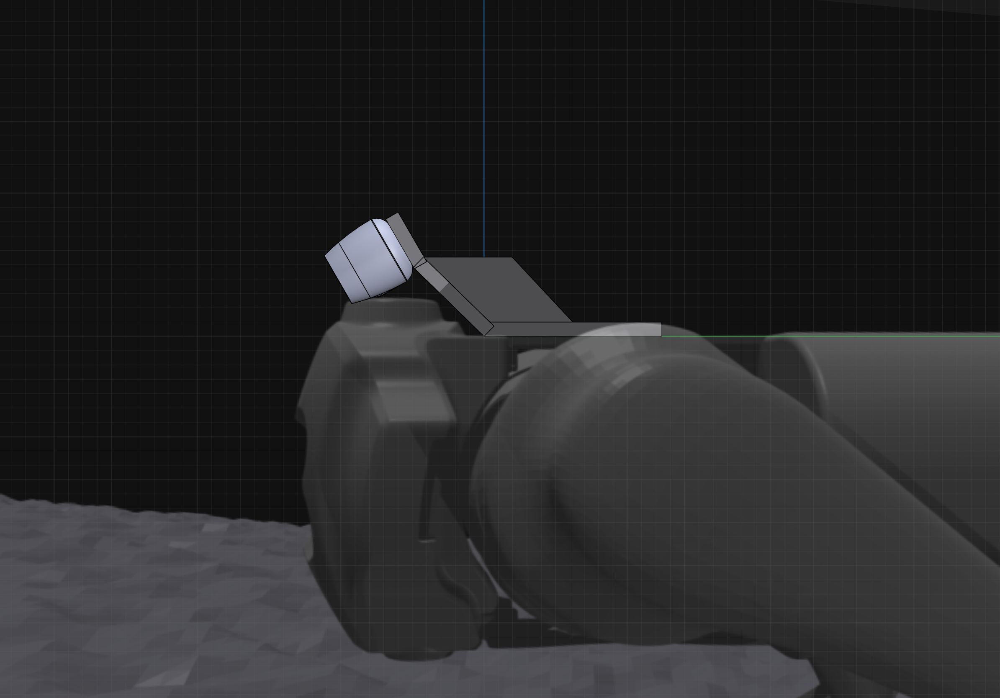

# Deploy the model on your real Unitree Go1 robot

This version shows an example of how to deploy the model on the Unittree Go1 robot (with Nvidia Jetson NX).

## Install dependencies on Go1
To deploy the trained model on Go1, please set up a folder on your robot, e.g. `parkour`, and copy the `rsl_rl` folder to it. Then, extract the zip files in `go1_ckpts` to the `parkour` folder. Finally, copy all the files in `onboard_script/go1` to the `parkour` folder.

1. Install ROS and the [unitree ros package for Go1](https://github.com/Tsinghua-MARS-Lab/unitree_ros_real.git) and follow the instructions to set up the robot on branch `go1`

    Assuming the ros workspace is located in `parkour/unitree_ws`

2. Install pytorch on a Python 3 environment. (take the Python3 virtual environment on Nvidia Jetson NX as an example)
    ```bash
    sudo apt-get install python3-pip python3-dev python3-venv
    python3 -m venv parkour_venv
    source parkour_venv/bin/activate
    ```
    Download the pip wheel file from [here](https://forums.developer.nvidia.com/t/pytorch-for-jetson/72048) with v1.10.0. Then install it with
    ```bash
    pip install torch-1.10.0-cp36-cp36m-linux_aarch64.whl
    ```

3. Install other dependencies and `rsl_rl`
    ```bash
    pip install numpy==1.16.4 numpy-ros
    pip install -e ./rsl_rl
    ```

4. 3D print the camera mount for Go1 using the step file in `go1_ckpts/go1_camMount_30Down.step`. Use the two pairs of screw holes to mount the Intel Realsense D435i camera on the robot, as shown in the picture below.
    
    <p align="center">
    
    </p>

## Run the model on Go1

***Disclaimer:*** *Always put a safety belt on the robot when the robot moves. The robot may fall down and cause damage to itself or the environment.*

1. Put the robot on the ground, power on the robot, and turn the robot into developer mode. Make sure your Intel Realsense D435i camera is connected to the robot and the camera is installed on the mount.

2. Launch 3 terminals onboard (whether 3 ssh connections from your computer or something else), named T_ros, T_visual, T_gru.


3. In T_ros, run
    ```bash
    cd parkour/unitree_ws
    source devel/setup.bash
    roslaunch unitree_legged_real robot.launch
    ```
    This will launch the ros node for Go1. Please note that without `dryrun:=False` the robot will not move but do anything else. Set `dryrun:=False` only when you are ready to let the robot move.

4. In T_visual, run
    ```bash
    cd parkour
    source unitree_ws/devel/setup.bash
    source parkour_venv/bin/activate
    python go1_visual_embedding.py --logdir Nov02...
    ```
    where `Nov02...` is the logdir of the trained model.

    Wait for the script to finish loading the model and get access to the Realsense sensor pipeline. Then, you can see the script prompting you: `"Realsense frame received. Sending embeddings..."`

    Adding the `--enable_vis` option will enable the depth image message as a rostopic. You can visualize the depth image in rviz.

5. In T_gru, run
    ```bash
    cd parkour
    source unitree_ws/devel/setup.bash
    source parkour_venv/bin/activate
    python a1_ros_run.py --mode upboard --logdir Nov02...
    ```
    where `Nov02...` is the logdir of the trained model.

    If the ros node is launched with `dryrun:=False`, the robot will start standing up. Otherwise, add `--debug` option on `a1_ros_run.py` to see the model output.

    If the ros node is launched with `dryrun:=False`, the script will prompt you: `"Robot stood up! press R1 on the remote control to continue ..."` Press R1 on the remote control to start the standing policy

    Pushing R-Y forward on the remote control to trigger the parkour policy. The robot will start running and jumping. Release the joystick to stop the robot.

    Press R2 on the remote control to shutdown the gru script and the ros node. You can also use it in case of emergency.

    Using the `--walkdir` option to load the walking policy e.g. (Oct24_16...), the standing policy will be replaced by the walking policy. Then you can use L-Y, L-X to control the x/y velocity of the robot and use R-X to control the yaw velocity of the robot.

